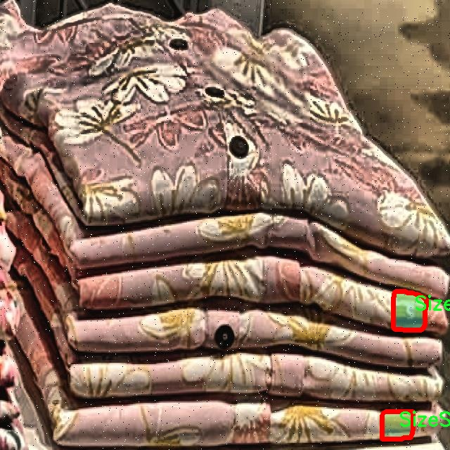

# 服装标签贴纸分割系统源码＆数据集分享
 [yolov8-seg-ContextGuidedDown＆yolov8-seg-CSwinTransformer等50+全套改进创新点发刊_一键训练教程_Web前端展示]

### 1.研究背景与意义

项目参考[ILSVRC ImageNet Large Scale Visual Recognition Challenge](https://gitee.com/YOLOv8_YOLOv11_Segmentation_Studio/projects)

项目来源[AAAI Global Al lnnovation Contest](https://kdocs.cn/l/cszuIiCKVNis)

研究背景与意义

随着电子商务的迅猛发展，服装行业面临着前所未有的机遇与挑战。在这一背景下，如何提升在线购物体验、提高商品的可视化程度，成为了商家和研究者们亟待解决的问题。服装标签贴纸作为商品的重要组成部分，不仅提供了产品的基本信息，如尺码、成分和洗涤说明，还在一定程度上影响着消费者的购买决策。因此，准确、快速地识别和分割服装标签贴纸，对于提升商品展示效果、优化库存管理、提高客户满意度具有重要意义。

近年来，深度学习技术的迅猛发展为图像处理领域带来了革命性的变化。尤其是目标检测和实例分割技术的进步，使得在复杂背景下对特定目标进行精准识别和分割成为可能。YOLO（You Only Look Once）系列模型以其高效的实时处理能力和良好的检测精度，成为了目标检测领域的热门选择。YOLOv8作为该系列的最新版本，进一步提升了模型的性能，适用于多种实际应用场景。然而，尽管YOLOv8在目标检测方面表现出色，但在特定领域如服装标签贴纸的分割任务中，仍然存在一定的局限性。因此，基于改进YOLOv8的服装标签贴纸分割系统的研究显得尤为重要。

本研究的核心在于利用SizeSticker数据集，该数据集包含2800张服装标签贴纸的图像，且仅有一个类别（SizeSticker），为实例分割任务提供了良好的基础。通过对该数据集的深入分析和处理，结合YOLOv8的优势，研究者可以在保证分割精度的同时，提升模型的训练效率和推理速度。此外，改进YOLOv8的模型结构和训练策略，将有助于克服现有模型在处理小目标和复杂背景时的不足，从而实现对服装标签贴纸的高效分割。

本研究的意义不仅在于推动服装行业的智能化发展，还在于为相关领域的研究提供借鉴。通过改进YOLOv8的实例分割系统，研究者可以探索更多深度学习技术在实际应用中的潜力，尤其是在零售、库存管理和消费者行为分析等方面。同时，研究成果也将为后续的研究提供数据支持和技术参考，促进学术界与产业界的合作与交流。

综上所述，基于改进YOLOv8的服装标签贴纸分割系统的研究，不仅具有重要的理论价值，还有着广泛的实际应用前景。通过对服装标签贴纸的精准分割，能够有效提升商品信息的可视化程度，优化消费者的购物体验，从而推动服装行业的持续发展。

### 2.图片演示


##### 注意：由于此博客编辑较早，上面“2.图片演示”和“3.视频演示”展示的系统图片或者视频可能为老版本，新版本在老版本的基础上升级如下：（实际效果以升级的新版本为准）

  （1）适配了YOLOV8的“目标检测”模型和“实例分割”模型，通过加载相应的权重（.pt）文件即可自适应加载模型。

  （2）支持“图片识别”、“视频识别”、“摄像头实时识别”三种识别模式。

  （3）支持“图片识别”、“视频识别”、“摄像头实时识别”三种识别结果保存导出，解决手动导出（容易卡顿出现爆内存）存在的问题，识别完自动保存结果并导出到tempDir中。

  （4）支持Web前端系统中的标题、背景图等自定义修改，后面提供修改教程。

  另外本项目提供训练的数据集和训练教程,暂不提供权重文件（best.pt）,需要您按照教程进行训练后实现图片演示和Web前端界面演示的效果。

### 3.视频演示

[3.1 视频演示](https://www.bilibili.com/video/BV1bESQYxE3X/)

### 4.数据集信息展示

##### 4.1 本项目数据集详细数据（类别数＆类别名）

nc: 1
names: ['SizeSticker']


##### 4.2 本项目数据集信息介绍

数据集信息展示

在本研究中，我们采用了名为“SizeSticker”的数据集，以训练和改进YOLOv8-seg模型，旨在实现高效的服装标签贴纸分割系统。该数据集专注于单一类别的目标检测与分割，类别数量为1，具体类别为“SizeSticker”。这一设计选择使得数据集在处理服装标签贴纸的任务时，能够提供更为精准和专注的训练样本，进而提升模型在实际应用中的表现。

“SizeSticker”数据集的构建经过精心设计，确保了数据的多样性和代表性。数据集中包含了大量的服装标签贴纸图像，这些图像来源于不同的服装品牌和款式，涵盖了多种颜色、形状和尺寸的标签贴纸。这种多样性不仅使得模型能够学习到不同类型标签的特征，还能提高其在复杂背景下的分割能力。数据集中的图像均经过标注，确保每个标签贴纸的边界清晰可见，为模型的训练提供了可靠的监督信号。

在数据预处理阶段，我们对图像进行了多种增强操作，如旋转、缩放、裁剪和颜色调整等。这些操作的目的是增加数据集的有效样本数量，提升模型的泛化能力。通过这种方式，模型能够在面对不同的拍摄角度和光照条件时，依然保持良好的分割性能。此外，数据集中还包含了一些带有噪声和干扰背景的图像，以模拟真实世界中可能遇到的复杂场景，进一步提高模型的鲁棒性。

在训练过程中，我们采用了先进的深度学习技术，结合YOLOv8-seg的特性，针对“SizeSticker”数据集进行了多轮迭代训练。模型通过不断调整参数，逐步优化分割效果，最终实现了对服装标签贴纸的高精度分割。通过与传统分割方法的对比，我们发现，基于“SizeSticker”数据集训练的YOLOv8-seg模型在分割精度和速度上均表现出色，能够在实时应用中满足需求。

此外，为了评估模型的性能，我们采用了多种指标，包括交并比（IoU）、精确率（Precision）和召回率（Recall）等。这些指标不仅帮助我们量化模型的分割效果，也为后续的模型优化提供了重要依据。通过对模型在“SizeSticker”数据集上的表现进行分析，我们能够识别出潜在的改进方向，从而不断提升系统的整体性能。

总之，“SizeSticker”数据集为我们改进YOLOv8-seg的服装标签贴纸分割系统提供了坚实的基础。通过对该数据集的深入研究与应用，我们期望能够在服装行业中实现更高效的标签识别与分割，为相关应用提供强有力的技术支持。随着技术的不断进步和数据集的不断完善，我们相信，未来的服装标签贴纸分割系统将会更加智能化和自动化，为消费者和企业带来更大的便利。




### 5.全套项目环境部署视频教程（零基础手把手教学）

[5.1 环境部署教程链接（零基础手把手教学）](https://www.bilibili.com/video/BV1jG4Ve4E9t/?vd_source=bc9aec86d164b67a7004b996143742dc)


[5.2 安装Python虚拟环境创建和依赖库安装视频教程链接（零基础手把手教学）](https://www.bilibili.com/video/BV1nA4VeYEze/?vd_source=bc9aec86d164b67a7004b996143742dc)

### 6.手把手YOLOV8-seg训练视频教程（零基础小白有手就能学会）

[6.1 手把手YOLOV8-seg训练视频教程（零基础小白有手就能学会）](https://www.bilibili.com/video/BV1cA4VeYETe/?vd_source=bc9aec86d164b67a7004b996143742dc)


按照上面的训练视频教程链接加载项目提供的数据集，运行train.py即可开始训练



     Epoch   gpu_mem       box       obj       cls    labels  img_size
     1/200     0G   0.01576   0.01955  0.007536        22      1280: 100%|██████████| 849/849 [14:42<00:00,  1.04s/it]
               Class     Images     Labels          P          R     mAP@.5 mAP@.5:.95: 100%|██████████| 213/213 [01:14<00:00,  2.87it/s]
                 all       3395      17314      0.994      0.957      0.0957      0.0843

     Epoch   gpu_mem       box       obj       cls    labels  img_size
     2/200     0G   0.01578   0.01923  0.007006        22      1280: 100%|██████████| 849/849 [14:44<00:00,  1.04s/it]
               Class     Images     Labels          P          R     mAP@.5 mAP@.5:.95: 100%|██████████| 213/213 [01:12<00:00,  2.95it/s]
                 all       3395      17314      0.996      0.956      0.0957      0.0845

     Epoch   gpu_mem       box       obj       cls    labels  img_size
     3/200     0G   0.01561    0.0191  0.006895        27      1280: 100%|██████████| 849/849 [10:56<00:00,  1.29it/s]
               Class     Images     Labels          P          R     mAP@.5 mAP@.5:.95: 100%|███████   | 187/213 [00:52<00:00,  4.04it/s]
                 all       3395      17314      0.996      0.957      0.0957      0.0845


### 7.50+种全套YOLOV8-seg创新点代码加载调参视频教程（一键加载写好的改进模型的配置文件）

[7.1 50+种全套YOLOV8-seg创新点代码加载调参视频教程（一键加载写好的改进模型的配置文件）](https://www.bilibili.com/video/BV1Hw4VePEXv/?vd_source=bc9aec86d164b67a7004b996143742dc)

### 8.YOLOV8-seg图像分割算法原理

原始YOLOv8-seg算法原理

YOLOv8-seg算法是YOLO系列中的最新进展，旨在在目标检测的基础上，进一步扩展到实例分割任务。作为一种基于卷积神经网络的深度学习模型，YOLOv8-seg不仅能够准确地检测图像中的目标，还能够为每个目标生成精确的分割掩码，从而实现更为细致的图像理解。该算法在2023年由Ultralytics公司发布，作为YOLOv7的继任者，YOLOv8-seg在多个方面进行了优化，尤其是在网络结构、训练策略和损失函数的设计上，力求在精度和速度之间达到最佳平衡。

YOLOv8-seg的核心在于其深度卷积神经网络架构，采用了更深的网络层次和更复杂的特征提取机制，使得模型能够从输入图像中提取出更为丰富的特征信息。与传统的滑动窗口或区域提议方法不同，YOLOv8-seg直接将整个图像作为输入，利用全卷积网络的特性，快速而高效地进行目标检测和分割。这种方法不仅提高了检测的速度，还在一定程度上提升了检测的精度，使得YOLOv8-seg在实时应用中表现出色。

在网络结构方面，YOLOv8-seg分为四个主要部分：输入端、骨干网络、颈部网络和头部网络。输入端通过马赛克数据增强、自适应锚框计算和自适应灰度填充等技术，增强了模型对不同输入数据的适应能力。骨干网络采用了C2f结构和空间金字塔池化（SPPF）模块，C2f模块通过跨层连接增强了梯度流动，提升了特征表示能力，而SPPF则通过多尺度特征融合，进一步提高了模型对不同尺度目标的检测能力。

颈部网络采用路径聚合网络（PAN）结构，旨在加强不同尺度特征的融合能力，使得模型在处理复杂场景时能够更好地捕捉到目标的细节信息。头部网络则负责将分类和检测过程解耦，主要包括损失计算和目标检测框筛选。YOLOv8-seg在损失计算中引入了Task-Aligned Assigner策略，通过分类与回归的分数加权结果选择正样本，从而提高了样本分配的准确性。

YOLOv8-seg在损失函数的设计上也进行了创新，采用了二元交叉熵损失（BCELoss）和分布焦点损失（DFLoss）相结合的方式，提升了模型对边界框预测的精准性。同时，完全交并比损失（CIOULoss）被引入以优化目标检测的性能，这种综合的损失计算策略使得YOLOv8-seg在目标检测和实例分割任务中均表现出色。

此外，YOLOv8-seg在模型轻量化方面也进行了优化，通过精简模型结构和调整不同尺度模型的通道数，进一步提升了模型的性能和实时性。与YOLOv5相比，YOLOv8-seg不仅在检测精度上有显著提升，帧率也得到了大幅提高，这使得该算法在智能监控、自动驾驶、医疗影像分析等多种应用场景中具备了更强的实用性。

YOLOv8-seg的创新之处还在于其无锚框检测头的引入，取代了传统的锚框预测方式，这一改进不仅减少了锚框预测的数量，还加速了非最大抑制（NMS）过程，从而进一步提升了模型的检测速度和准确性。通过将分类和检测头分离，YOLOv8-seg能够在保持高效性的同时，提升目标检测的精度，尤其是在复杂背景下的目标分割任务中表现尤为突出。

总的来说，YOLOv8-seg算法通过对网络结构的深度优化、损失函数的创新设计以及轻量化策略的实施，成功地在目标检测和实例分割领域实现了高效与精度的双重提升。其广泛的应用潜力使得YOLOv8-seg成为当前目标检测和分割任务中的一项重要技术，推动了计算机视觉领域的进一步发展。通过对YOLOv8-seg的深入研究和应用，未来的智能系统将能够更好地理解和解析复杂的视觉信息，为各类实际应用提供强有力的支持。


### 9.系统功能展示（检测对象为举例，实际内容以本项目数据集为准）

图9.1.系统支持检测结果表格显示

  图9.2.系统支持置信度和IOU阈值手动调节

  图9.3.系统支持自定义加载权重文件best.pt(需要你通过步骤5中训练获得)

  图9.4.系统支持摄像头实时识别

  图9.5.系统支持图片识别

  图9.6.系统支持视频识别

  图9.7.系统支持识别结果文件自动保存

  图9.8.系统支持Excel导出检测结果数据


### 10.50+种全套YOLOV8-seg创新点原理讲解（非科班也可以轻松写刊发刊，V11版本正在科研待更新）

#### 10.1 由于篇幅限制，每个创新点的具体原理讲解就不一一展开，具体见下列网址中的创新点对应子项目的技术原理博客网址【Blog】：


[10.1 50+种全套YOLOV8-seg创新点原理讲解链接](https://gitee.com/qunmasj/good)

#### 10.2 部分改进模块原理讲解(完整的改进原理见上图和技术博客链接)【如果此小节的图加载失败可以通过CSDN或者Github搜索该博客的标题访问原始博客，原始博客图片显示正常】
### YOLOv8简介
目前YOLO系列的SOTA模型是ultralytics公司于2023年发布的YOLOv8.按照模型宽度和深度不同分为YOLOv8n、YOLOv8s、YOLOv8m、YOLOv81、YOLOv8x五个版本。本文改进的是 YOLOv8n模型。
YOLOv8的 Backbone采用CSPDarknet结构，它是 Darknet 的一种改进，引入CSP改善网络结构。CSPDarknet把特征图分为两部分，一部分进行卷积操作，另一部分进行跳跃连接，在保持网络深度的同时减少参数量和计算量，提高网络效率。Neck 部分采用特征金字塔PANet[17]，通过自顶向下路径结合和自底向上特征传播进行多尺度融合。损失函数采用了CIloU[18]。YOLOv8的网络结构如图所示。


### ParC融合位置感知循环卷积简介
ParC：Position aware circular convolution


#### Position aware circular convolution
针对于全局信息的提取作者提出了Position aware circular convolution（也称作Global Circular Convolution）。图中左右实际是对于该操作水平竖直两方向的对称，理解时只看左边即可。对于维度为C*H*W的输入，作者先将维度为C*B*1的Position Embedding通过双线性插值函数F调整到适合input的维度C*H*1（以适应不同特征大小输入），并且将PE水平复制扩展到C*H*W维度与输入特征相加。这里作者将PE直接设置成为了可学习的参数。

接下来参考该博客将加入PE的特征图竖直方向堆叠，并且同样以插值的方式得到了适应输入维度的C*H*1大小的卷积核，进行卷积操作。对于这一步卷积，作者将之称为循环卷积，并给出了一个卷积示意图。


但个人感觉实际上这个示意图只是为了说明为什么叫循环卷积，对于具体的计算细节还是根据公式理解更好。


进一步，作者给出了这一步的伪代码来便于读者对这一卷积的理解：y=F.conv2D（torch.cat（xp，xp，dim=2），kV），实际上就是将xp堆叠之后使用了一个“条形（或柱形）”卷积核进行简单的卷积操作。（但这样会导致多一次重复卷积，因此在堆叠示意图中只取了前2*H-1行）

可以看到在示意图中特征维度变化如下：C*(2H-1)*W ---C*H*1--->C*H*W，作者特意带上了通道数，并且并没有出现通道数的改变，那么这里所进行的卷积应该是depth wise卷积，通过对文章后续以及论文源码的阅读可以得知这一步进行的就是DW卷积。（we introduce group convolution and point wise convolution into these modules, which decreases number of parameters without hurting performance.）


由groups = channel可知使用的是DW卷积
通过上面就完成了一次竖直方向的全局信息交流，同样只要在水平方向进行同样的操作即可做到水平方向的全局信息交流。

#### ParC block

通过ParC成功解决了全局信息提取的问题，接下来就是针对2）3）两点进行改进。首先是Meta-Former模块，Meta-Former由Token Mixer和Channel Mixer构成，ParC首先满足了Token Mixer的全局信息提取的要求，并且相较于Attention在计算成本上更低。


这里①中的PWC即point wise conv，进一步验证了我们前面对于深度可分离卷积的想法，而GCC-H/V即是前面所说的ParC-H/V。

①构建了Meta-Former中的Token mixer模块，那么最后剩下的问题就是3），替换掉Attention模块之后模型不再data driven。为了解决这一点作者给出了一个channel wise attention，先将特征图（x,C*H*W）进行global average（a,C*1*1）并输入一个MLP生成一个channel wise的权重（w,C*1*1），再将权重与特征图在通道方向相乘得到输出（output = wx,C*H*W）。

#### ParC net
对于ParC net 的搭建，作者直接基于MobileViT，采用了分叉结构（c）完成了网络的搭建。


具体而言作者保留了MobileViT中浅层具有局部感受野的MobileNetV2结构，而将网络深层的ViT block替换成了ParC block，使网络变成了一个pure ConvNet。


### 11.项目核心源码讲解（再也不用担心看不懂代码逻辑）

#### 11.1 ultralytics\models\fastsam\model.py

以下是对给定代码的核心部分进行分析和详细注释的结果：

```python
# Ultralytics YOLO 🚀, AGPL-3.0 license

from pathlib import Path  # 导入Path类，用于处理文件路径
from ultralytics.engine.model import Model  # 从ultralytics库中导入Model类

# 导入FastSAM相关的预测和验证类
from .predict import FastSAMPredictor  
from .val import FastSAMValidator  


class FastSAM(Model):
    """
    FastSAM模型接口。

    示例用法：
        ```python
        from ultralytics import FastSAM

        model = FastSAM('last.pt')  # 创建FastSAM模型实例，加载预训练模型
        results = model.predict('ultralytics/assets/bus.jpg')  # 对输入图像进行预测
        ```
    """

    def __init__(self, model='FastSAM-x.pt'):
        """初始化FastSAM类，调用父类Model的初始化方法，并设置默认模型为'FastSAM-x.pt'。"""
        # 如果传入的模型名是'FastSAM.pt'，则将其替换为'FastSAM-x.pt'
        if str(model) == 'FastSAM.pt':
            model = 'FastSAM-x.pt'
        
        # 确保传入的模型文件不是yaml格式，FastSAM模型只支持预训练模型
        assert Path(model).suffix not in ('.yaml', '.yml'), 'FastSAM models only support pre-trained models.'
        
        # 调用父类Model的初始化方法，设置模型和任务类型为'segment'
        super().__init__(model=model, task='segment')

    @property
    def task_map(self):
        """返回一个字典，将分割任务映射到相应的预测器和验证器类。"""
        return {
            'segment': {
                'predictor': FastSAMPredictor,  # 预测器类
                'validator': FastSAMValidator     # 验证器类
            }
        }
```

### 代码核心部分分析：

1. **类定义**：
   - `FastSAM`类继承自`Model`类，表示这是一个用于快速分割任务的模型接口。

2. **初始化方法**：
   - `__init__`方法用于初始化模型实例，设置默认模型文件，并确保模型文件格式正确。

3. **任务映射**：
   - `task_map`属性返回一个字典，映射了分割任务到相应的预测器和验证器类，便于后续的预测和验证操作。

### 注释说明：
- 代码中的注释详细解释了每个部分的功能和目的，帮助理解模型的初始化和任务处理方式。

这个文件是一个名为 `model.py` 的 Python 文件，属于 Ultralytics YOLO 项目的一部分，主要用于定义 FastSAM 模型的接口。文件中首先导入了一些必要的模块和类，包括 `Path` 类用于处理文件路径，`Model` 类作为基类，以及 `FastSAMPredictor` 和 `FastSAMValidator` 类用于预测和验证。

在文件中定义了一个名为 `FastSAM` 的类，该类继承自 `Model` 类。这个类的主要功能是为 FastSAM 模型提供一个接口，使得用户可以方便地加载模型并进行预测。

在 `FastSAM` 类的构造函数 `__init__` 中，首先检查传入的模型文件名，如果是 'FastSAM.pt'，则将其替换为 'FastSAM-x.pt'。接着，使用 `assert` 语句确保传入的模型文件名后缀不是 `.yaml` 或 `.yml`，因为 FastSAM 模型只支持预训练模型。最后，调用父类 `Model` 的构造函数，传入模型文件名和任务类型（这里是 'segment'，表示分割任务）。

此外，`FastSAM` 类还定义了一个属性 `task_map`，它返回一个字典，该字典将分割任务映射到相应的预测器和验证器类。这使得在进行分割任务时，可以方便地获取到对应的预测和验证工具。

整体来看，这个文件的主要目的是为 FastSAM 模型提供一个结构化的接口，使得用户能够简单地加载模型并进行图像分割任务的预测和验证。通过这种设计，用户可以轻松地使用 FastSAM 模型进行实际应用。

#### 11.2 ultralytics\models\yolo\segment\predict.py

以下是经过简化和注释的核心代码部分：

```python
# 导入必要的模块和类
from ultralytics.engine.results import Results
from ultralytics.models.yolo.detect.predict import DetectionPredictor
from ultralytics.utils import ops

class SegmentationPredictor(DetectionPredictor):
    """
    扩展自 DetectionPredictor 类，用于基于分割模型的预测。
    """

    def __init__(self, cfg=DEFAULT_CFG, overrides=None, _callbacks=None):
        """初始化 SegmentationPredictor，设置配置、覆盖参数和回调函数。"""
        super().__init__(cfg, overrides, _callbacks)  # 调用父类构造函数
        self.args.task = 'segment'  # 设置任务类型为分割

    def postprocess(self, preds, img, orig_imgs):
        """对每个输入图像的预测结果进行后处理，包括非极大值抑制和掩膜处理。"""
        # 应用非极大值抑制，过滤掉低置信度的检测框
        p = ops.non_max_suppression(preds[0],
                                     self.args.conf,  # 置信度阈值
                                     self.args.iou,   # IOU 阈值
                                     agnostic=self.args.agnostic_nms,  # 是否类别无关
                                     max_det=self.args.max_det,  # 最大检测框数量
                                     nc=len(self.model.names),  # 类别数量
                                     classes=self.args.classes)  # 指定的类别

        # 如果输入图像不是列表，则将其转换为 NumPy 数组
        if not isinstance(orig_imgs, list):
            orig_imgs = ops.convert_torch2numpy_batch(orig_imgs)

        results = []  # 存储处理后的结果
        proto = preds[1][-1] if len(preds[1]) == 3 else preds[1]  # 获取掩膜原型

        # 遍历每个预测结果
        for i, pred in enumerate(p):
            orig_img = orig_imgs[i]  # 获取原始图像
            img_path = self.batch[0][i]  # 获取图像路径

            if not len(pred):  # 如果没有检测到框
                masks = None  # 掩膜为空
            elif self.args.retina_masks:  # 如果使用 Retina 掩膜
                # 缩放检测框到原始图像尺寸
                pred[:, :4] = ops.scale_boxes(img.shape[2:], pred[:, :4], orig_img.shape)
                # 处理掩膜
                masks = ops.process_mask_native(proto[i], pred[:, 6:], pred[:, :4], orig_img.shape[:2])  # HWC
            else:  # 使用常规掩膜处理
                masks = ops.process_mask(proto[i], pred[:, 6:], pred[:, :4], img.shape[2:], upsample=True)  # HWC
                # 缩放检测框到原始图像尺寸
                pred[:, :4] = ops.scale_boxes(img.shape[2:], pred[:, :4], orig_img.shape)

            # 将结果存储到 Results 对象中
            results.append(Results(orig_img, path=img_path, names=self.model.names, boxes=pred[:, :6], masks=masks))

        return results  # 返回处理后的结果列表
```

### 代码注释说明：
1. **导入模块**：引入了处理结果和预测的相关类和工具函数。
2. **SegmentationPredictor 类**：这是一个用于图像分割的预测器，继承自 `DetectionPredictor`。
3. **构造函数**：初始化时设置任务类型为分割，并调用父类的构造函数。
4. **后处理函数**：该函数对模型的预测结果进行后处理，包括非极大值抑制和掩膜处理。根据不同条件（如是否使用 Retina 掩膜）处理检测框和掩膜，并将结果存储在 `Results` 对象中。

这个程序文件是Ultralytics YOLO模型中的一个分割预测模块，文件名为`predict.py`。该模块主要用于基于分割模型进行图像分割的预测，继承自检测预测器`DetectionPredictor`。文件中包含了一个`SegmentationPredictor`类，该类扩展了检测预测器的功能，专门用于处理图像分割任务。

在类的构造函数`__init__`中，调用了父类的初始化方法，并设置了任务类型为“segment”，表示该类的主要功能是进行图像分割。构造函数接受三个参数：配置`cfg`、覆盖参数`overrides`和回调函数`_callbacks`，其中`cfg`的默认值为`DEFAULT_CFG`。

`postprocess`方法是该类的核心功能之一，用于对模型的预测结果进行后处理。该方法接受三个参数：`preds`（模型的预测结果）、`img`（输入图像）和`orig_imgs`（原始图像）。在方法内部，首先使用非极大值抑制（NMS）来过滤掉重叠的检测框，以提高预测的准确性。然后，将输入的图像转换为NumPy数组格式（如果输入是PyTorch张量的话）。

接下来，方法会根据预测结果的不同情况处理分割掩码。对于每个预测结果，方法会检查是否有检测到的目标。如果没有检测到目标，则掩码设置为`None`；如果启用了“视网膜掩码”选项，则会调用相应的处理函数生成掩码。否则，使用另一种处理方式生成掩码，并进行必要的缩放操作以适应原始图像的尺寸。

最后，方法将处理后的结果封装为`Results`对象，并将其添加到结果列表中。这个结果对象包含了原始图像、图像路径、模型类别名称、检测框和掩码等信息。最终，`postprocess`方法返回所有处理后的结果。

整体来看，这个模块提供了一个灵活的框架，用于在YOLO模型上进行图像分割的预测和后处理，方便用户在实际应用中进行图像分割任务。

#### 11.3 ultralytics\models\sam\__init__.py

以下是代码中最核心的部分，并附上详细的中文注释：

```python
# 导入SAM模型和预测器
from .model import SAM  # 从当前包的model模块中导入SAM类
from .predict import Predictor  # 从当前包的predict模块中导入Predictor类

# 定义模块的公开接口
__all__ = 'SAM', 'Predictor'  # 指定在使用from module import *时，允许导入的对象
```

### 注释说明：
1. **导入模块**：
   - `from .model import SAM`：从当前包的`model`模块中导入`SAM`类，这通常是一个深度学习模型的定义。
   - `from .predict import Predictor`：从当前包的`predict`模块中导入`Predictor`类，这通常是用于执行预测的功能。

2. **定义公开接口**：
   - `__all__`：这是一个特殊的变量，用于定义当使用`from module import *`时，哪些对象是可以被导入的。在这里，只有`SAM`和`Predictor`两个类会被导入，其他的类或函数将不会被导入。这有助于控制模块的公共接口，避免不必要的命名冲突。

这个程序文件是一个Python模块的初始化文件，通常用于定义模块的公共接口。在这个文件中，首先有一个注释，提到这是与Ultralytics YOLO相关的代码，并且遵循AGPL-3.0许可证。

接下来，文件通过相对导入的方式引入了两个类：`SAM`和`Predictor`。`SAM`可能是一个与模型相关的类，而`Predictor`则可能是用于进行预测的类。这种导入方式使得在使用这个模块时，可以直接访问这两个类，而不需要知道它们具体的实现细节。

最后，`__all__`变量被定义为一个元组，包含了`'SAM'`和`'Predictor'`。这个变量的作用是控制从这个模块中导入的内容。当使用`from module import *`语句时，只有在`__all__`中列出的名称会被导入。这有助于避免命名冲突，并明确模块的公共接口。

总的来说，这个文件的主要功能是组织和暴露模块的核心功能，确保用户可以方便地使用`SAM`和`Predictor`这两个类。

#### 11.4 ultralytics\nn\extra_modules\ops_dcnv3\modules\__init__.py

以下是保留的核心代码部分，并附上详细的中文注释：

```python
# 导入所需的模块
from .dcnv3 import DCNv3, DCNv3_pytorch, DCNv3_DyHead

# 以上代码从当前包（.）中的 dcnv3 模块导入了三个类或函数：
# 1. DCNv3：可能是一个深度可分离卷积网络的实现。
# 2. DCNv3_pytorch：可能是针对 PyTorch 框架的 DCNv3 实现。
# 3. DCNv3_DyHead：可能是一个动态头部的实现，用于处理特定任务的输出。
```

在这个代码片段中，主要的功能是从 `dcnv3` 模块中导入三个组件，以便在当前模块中使用。这些组件可能与深度学习模型的构建和训练有关。

这个程序文件是一个Python模块的初始化文件，位于`ultralytics/nn/extra_modules/ops_dcnv3/modules/`目录下。文件的开头包含了一些版权信息，表明该代码属于OpenGVLab，并且是根据MIT许可证进行授权的，这意味着用户可以自由使用、修改和分发该代码，只要遵循许可证的条款。

文件的主要功能是导入其他模块中的类或函数。在这里，它从同一目录下的`dcnv3`模块中导入了三个对象：`DCNv3`、`DCNv3_pytorch`和`DCNv3_DyHead`。这些对象可能是与深度学习相关的组件，特别是在实现某种类型的卷积操作时使用。

通过这种方式，其他模块在导入这个初始化文件时，可以直接使用`DCNv3`、`DCNv3_pytorch`和`DCNv3_DyHead`，而不需要显式地去引用`dcnv3`模块。这种做法有助于简化代码的结构，提高可读性和可维护性。总的来说，这个文件的作用是组织和管理深度学习模型中的一些扩展模块，使得它们可以更方便地被使用。

#### 11.5 ultralytics\utils\errors.py

```python
# 导入所需的工具函数
from ultralytics.utils import emojis

class HUBModelError(Exception):
    """
    自定义异常类，用于处理与Ultralytics YOLO模型获取相关的错误。

    当请求的模型未找到或无法检索时，将引发此异常。
    消息经过处理，以包含表情符号，以改善用户体验。

    属性:
        message (str): 引发异常时显示的错误消息。

    注意:
        消息通过'ultralytics.utils'包中的'emojis'函数自动处理。
    """

    def __init__(self, message='Model not found. Please check model URL and try again.'):
        """当模型未找到时创建异常。"""
        # 调用父类的构造函数，并将处理过的消息传递给它
        super().__init__(emojis(message))
```

### 代码核心部分说明：
1. **异常类定义**：`HUBModelError` 继承自 `Exception`，用于定义一个特定的异常类型，以便在模型未找到时进行错误处理。
2. **构造函数**：`__init__` 方法用于初始化异常对象，默认消息为“模型未找到，请检查模型URL并重试。”，并使用 `emojis` 函数处理消息，使其更具可读性和用户友好性。
3. **文档字符串**：提供了类和方法的详细说明，包括异常的用途、属性和注意事项，帮助其他开发者理解其功能。

这个程序文件是一个自定义异常类的实现，主要用于处理与Ultralytics YOLO模型获取相关的错误。文件名为`errors.py`，它包含了一个名为`HUBModelError`的异常类。

在这个类中，首先导入了`emojis`函数，这个函数来自于`ultralytics.utils`模块，用于在错误信息中添加表情符号，以提升用户体验。`HUBModelError`类继承自Python内置的`Exception`类，意味着它可以被用作标准异常处理的一部分。

类的文档字符串详细说明了这个异常类的用途和属性。它主要用于在请求的模型未找到或无法检索时抛出异常。类中定义了一个名为`message`的属性，表示在异常被抛出时显示的错误信息。默认情况下，错误信息为“Model not found. Please check model URL and try again.”，这提示用户检查模型的URL并重试。

在构造函数`__init__`中，调用了父类的构造函数，并将经过`emojis`函数处理后的消息传递给它。这意味着在抛出这个异常时，用户将看到一个包含表情符号的错误信息，使得错误提示更加友好和易于理解。

总的来说，这个文件提供了一种机制来处理模型获取过程中可能出现的错误，并通过表情符号增强了用户体验。

### 12.系统整体结构（节选）

### 整体功能和构架概括

Ultralytics项目是一个用于计算机视觉任务的深度学习框架，特别是目标检测和图像分割。该项目的结构清晰，模块化设计使得不同功能的实现相对独立，便于维护和扩展。以下是对各个文件的整体功能和架构的概括：

1. **模型定义与预测**：
   - `ultralytics/models/fastsam/model.py`定义了FastSAM模型的接口，允许用户加载模型并进行图像分割任务的预测。
   - `ultralytics/models/yolo/segment/predict.py`专注于YOLO模型的图像分割预测，提供了后处理功能以优化预测结果。

2. **模块组织**：
   - `ultralytics/models/sam/__init__.py`用于组织和暴露SAM模型的核心功能，简化用户的使用方式。

3. **扩展模块**：
   - `ultralytics/nn/extra_modules/ops_dcnv3/modules/__init__.py`负责导入和组织与DCNv3相关的扩展模块，提供了特定的卷积操作。

4. **错误处理**：
   - `ultralytics/utils/errors.py`定义了自定义异常类`HUBModelError`，用于处理模型获取过程中可能出现的错误，并通过友好的错误信息提升用户体验。

### 文件功能整理表

| 文件路径                                         | 功能描述                                               |
|--------------------------------------------------|--------------------------------------------------------|
| `ultralytics/models/fastsam/model.py`            | 定义FastSAM模型接口，支持模型加载和图像分割预测。    |
| `ultralytics/models/yolo/segment/predict.py`    | 实现YOLO模型的图像分割预测，包含预测结果的后处理功能。 |
| `ultralytics/models/sam/__init__.py`             | 组织和暴露SAM模型的核心功能，简化模块使用。           |
| `ultralytics/nn/extra_modules/ops_dcnv3/modules/__init__.py` | 导入和组织DCNv3相关的扩展模块，提供特定卷积操作。     |
| `ultralytics/utils/errors.py`                    | 定义自定义异常类`HUBModelError`，处理模型获取错误。   |

这个表格清晰地总结了每个文件的主要功能，帮助理解Ultralytics项目的整体架构和各个模块之间的关系。

注意：由于此博客编辑较早，上面“11.项目核心源码讲解（再也不用担心看不懂代码逻辑）”中部分代码可能会优化升级，仅供参考学习，完整“训练源码”、“Web前端界面”和“50+种创新点源码”以“14.完整训练+Web前端界面+50+种创新点源码、数据集获取”的内容为准。

### 13.图片、视频、摄像头图像分割Demo(去除WebUI)代码

在这个博客小节中，我们将讨论如何在不使用WebUI的情况下，实现图像分割模型的使用。本项目代码已经优化整合，方便用户将分割功能嵌入自己的项目中。
核心功能包括图片、视频、摄像头图像的分割，ROI区域的轮廓提取、类别分类、周长计算、面积计算、圆度计算以及颜色提取等。
这些功能提供了良好的二次开发基础。

### 核心代码解读

以下是主要代码片段，我们会为每一块代码进行详细的批注解释：

```python
import random
import cv2
import numpy as np
from PIL import ImageFont, ImageDraw, Image
from hashlib import md5
from model import Web_Detector
from chinese_name_list import Label_list

# 根据名称生成颜色
def generate_color_based_on_name(name):
    ......

# 计算多边形面积
def calculate_polygon_area(points):
    return cv2.contourArea(points.astype(np.float32))

...
# 绘制中文标签
def draw_with_chinese(image, text, position, font_size=20, color=(255, 0, 0)):
    image_pil = Image.fromarray(cv2.cvtColor(image, cv2.COLOR_BGR2RGB))
    draw = ImageDraw.Draw(image_pil)
    font = ImageFont.truetype("simsun.ttc", font_size, encoding="unic")
    draw.text(position, text, font=font, fill=color)
    return cv2.cvtColor(np.array(image_pil), cv2.COLOR_RGB2BGR)

# 动态调整参数
def adjust_parameter(image_size, base_size=1000):
    max_size = max(image_size)
    return max_size / base_size

# 绘制检测结果
def draw_detections(image, info, alpha=0.2):
    name, bbox, conf, cls_id, mask = info['class_name'], info['bbox'], info['score'], info['class_id'], info['mask']
    adjust_param = adjust_parameter(image.shape[:2])
    spacing = int(20 * adjust_param)

    if mask is None:
        x1, y1, x2, y2 = bbox
        aim_frame_area = (x2 - x1) * (y2 - y1)
        cv2.rectangle(image, (x1, y1), (x2, y2), color=(0, 0, 255), thickness=int(3 * adjust_param))
        image = draw_with_chinese(image, name, (x1, y1 - int(30 * adjust_param)), font_size=int(35 * adjust_param))
        y_offset = int(50 * adjust_param)  # 类别名称上方绘制，其下方留出空间
    else:
        mask_points = np.concatenate(mask)
        aim_frame_area = calculate_polygon_area(mask_points)
        mask_color = generate_color_based_on_name(name)
        try:
            overlay = image.copy()
            cv2.fillPoly(overlay, [mask_points.astype(np.int32)], mask_color)
            image = cv2.addWeighted(overlay, 0.3, image, 0.7, 0)
            cv2.drawContours(image, [mask_points.astype(np.int32)], -1, (0, 0, 255), thickness=int(8 * adjust_param))

            # 计算面积、周长、圆度
            area = cv2.contourArea(mask_points.astype(np.int32))
            perimeter = cv2.arcLength(mask_points.astype(np.int32), True)
            ......

            # 计算色彩
            mask = np.zeros(image.shape[:2], dtype=np.uint8)
            cv2.drawContours(mask, [mask_points.astype(np.int32)], -1, 255, -1)
            color_points = cv2.findNonZero(mask)
            ......

            # 绘制类别名称
            x, y = np.min(mask_points, axis=0).astype(int)
            image = draw_with_chinese(image, name, (x, y - int(30 * adjust_param)), font_size=int(35 * adjust_param))
            y_offset = int(50 * adjust_param)

            # 绘制面积、周长、圆度和色彩值
            metrics = [("Area", area), ("Perimeter", perimeter), ("Circularity", circularity), ("Color", color_str)]
            for idx, (metric_name, metric_value) in enumerate(metrics):
                ......

    return image, aim_frame_area

# 处理每帧图像
def process_frame(model, image):
    pre_img = model.preprocess(image)
    pred = model.predict(pre_img)
    det = pred[0] if det is not None and len(det)
    if det:
        det_info = model.postprocess(pred)
        for info in det_info:
            image, _ = draw_detections(image, info)
    return image

if __name__ == "__main__":
    cls_name = Label_list
    model = Web_Detector()
    model.load_model("./weights/yolov8s-seg.pt")

    # 摄像头实时处理
    cap = cv2.VideoCapture(0)
    while cap.isOpened():
        ret, frame = cap.read()
        if not ret:
            break
        ......

    # 图片处理
    image_path = './icon/OIP.jpg'
    image = cv2.imread(image_path)
    if image is not None:
        processed_image = process_frame(model, image)
        ......

    # 视频处理
    video_path = ''  # 输入视频的路径
    cap = cv2.VideoCapture(video_path)
    while cap.isOpened():
        ret, frame = cap.read()
        ......
```


### 14.完整训练+Web前端界面+50+种创新点源码、数据集获取


# [下载链接：https://mbd.pub/o/bread/Zp6akplq](https://mbd.pub/o/bread/Zp6akplq)